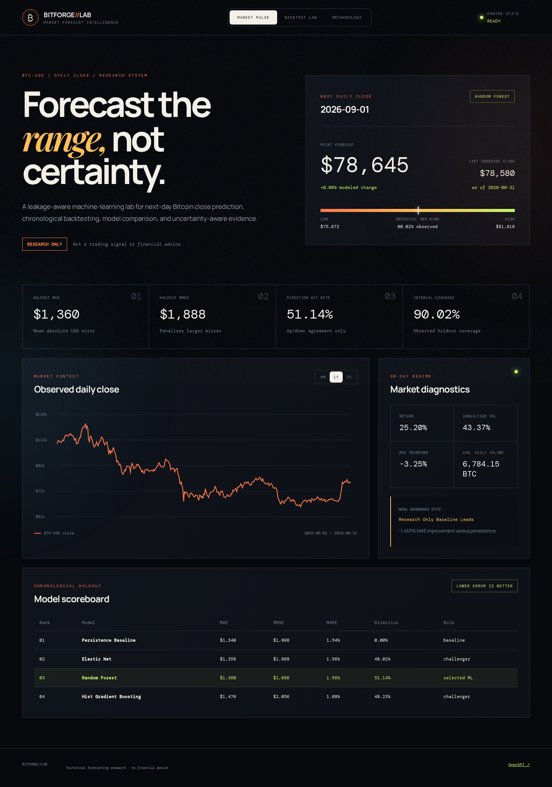
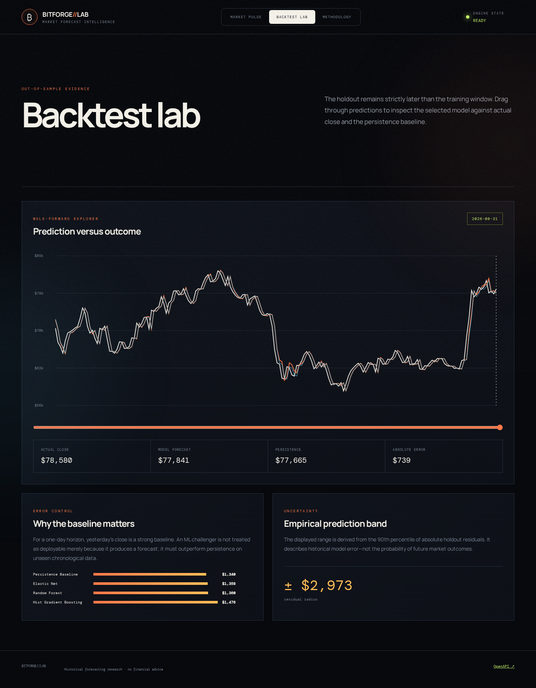
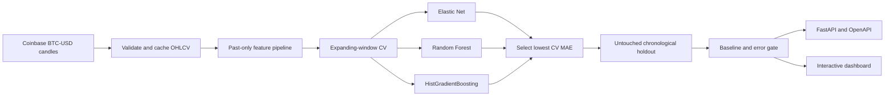

# Bitcoin Price Prediction Engine

An end-to-end machine-learning research platform for next-day **BTC-USD daily-close forecasting**. It downloads public Coinbase Exchange candles, builds past-only market features, compares regression models with time-aware validation, exposes the evidence through FastAPI, and presents the result in an interactive dashboard.

> **Research software — not financial advice.** The project does not place trades, recommend positions, or promise future returns.

## Product preview

### Market pulse and next-day forecast



### Chronological holdout explorer



### Leakage-safe methodology and feature influence


## What makes this a real project

- **Real market ingestion:** paginated BTC-USD candles from the public Coinbase Exchange API, with retries, validation, deduplication, UTC normalization, and a provenance record.
- **Leakage-safe features:** 22 features built only from data available at each daily close—returns, momentum, moving averages, MACD, volatility, RSI, price range, volume, and calendar cycles.
- **Time-aware validation:** expanding-window `TimeSeriesSplit` selects the ML candidate; the most recent 20% remains an untouched chronological holdout for final reporting.
- **Meaningful baseline:** every ML regressor is measured against the strong one-day persistence forecast: tomorrow's price equals today's close.
- **Honest model gate:** if the selected ML model does not beat persistence on unseen data, the system labels it `research_only_baseline_leads`.
- **Uncertainty evidence:** the forecast shows an empirical band calibrated from the 90th percentile of holdout absolute residuals.
- **Usable delivery:** REST endpoints, OpenAPI documentation, responsive dashboard, reproducible scripts, saved evidence, and automated tests.

## Verified experiment

This repository contains a reproducible run over **2,435 daily candles** from **2020-01-01 through 2026-08-31**. The model-selection window used expanding time splits; the final holdout contains **481 later observations** from **2025-05-08 through 2026-08-31**.

| Model | Selection CV MAE | Holdout MAE | Holdout RMSE | Holdout MAPE | Direction agreement |
|---|---:|---:|---:|---:|---:|
| Persistence baseline | — | **$1,340.47** | **$1,867.77** | **1.5389%** | 0.00%* |
| Elastic Net | $1,078.86 | $1,357.92 | $1,868.97 | 1.5605% | 48.02% |
| **Random Forest — selected by CV** | **$1,058.82** | $1,359.95 | $1,888.28 | 1.5575% | **51.14%** |
| Histogram Gradient Boosting | $1,187.64 | $1,475.76 | $2,055.83 | 1.6880% | 48.23% |

\*Persistence predicts zero price change, so it is not credited with an up/down call.

The Random Forest was selected **without looking at the final holdout**, because it had the lowest expanding-window CV MAE. On the later holdout, persistence had 1.45% lower MAE. The correct governance outcome is therefore:

```text
RESEARCH ONLY — BASELINE LEADS
```

That result is useful: it demonstrates why a high R² alone is not sufficient for price-level forecasting and why a naïve baseline belongs in every serious time-series evaluation.

### Latest generated research forecast

| Field | Value |
|---|---:|
| Last observed close, 2026-08-31 | $78,580.00 |
| Forecast for 2026-09-01 | $78,645.09 |
| Modeled change | +0.0828% |
| Empirical interval | $75,671.91 – $81,618.26 |
| Historical interval coverage | 90.02% |

This is a saved research output from the dated dataset snapshot, not a current quote or trading recommendation.

## System architecture



More detail: [architecture](docs/ARCHITECTURE.md), [data contract](docs/DATA_CONTRACT.md), and [model governance](docs/MODEL_GOVERNANCE.md).

## Quick start

Python 3.10 or newer is required.

```bash
git clone <repository-url>
cd Bitcoin_Price_Prediction_Engine
./scripts/setup.sh
./scripts/reproduce.sh
./scripts/run_dashboard.sh
```

Open the URL printed by the final command, normally `http://127.0.0.1:8560`.

`reproduce.sh` refreshes the official candles, trains and evaluates all candidates, writes the evidence artifacts, and runs the automated test suite. To train from the committed dated snapshot without network access:

```bash
source .venv/bin/activate
python scripts/train.py --data data/btc_usd_daily.csv --output-dir artifacts
pytest -q
```

## REST interface

| Endpoint | Purpose |
|---|---|
| `GET /api/health` | Runtime and artifact readiness |
| `GET /api/summary` | Forecast, metrics, holdout, and market regime |
| `GET /api/history?days=365` | Validated historical candles |
| `GET /api/backtest?days=180` | Day-level holdout evidence |
| `GET /api/forecast` | Latest saved research forecast and interval |
| `GET /api/models` | Candidate leaderboard and selected model |
| `GET /api/features?limit=12` | Holdout permutation influence |
| `GET /docs` | Interactive OpenAPI documentation |

Example:

```bash
curl http://127.0.0.1:8560/api/forecast
```

## Repository layout

```text
.
├── app.py                         # FastAPI serving layer
├── data/                          # Dated, validated market snapshot
├── artifacts/                     # Metrics, backtest, provenance, model card
├── docs/                           # Architecture and governance documents
├── scripts/                        # Setup, ingestion, training, run, screenshots
├── src/btc_forecast/              # Core data, features, and modeling package
├── tests/                          # Unit, artifact, and API tests
└── web/                            # Dependency-light dashboard
```

The binary model bundle is intentionally ignored by Git; regenerate it from the committed snapshot with `python scripts/train.py`.

## Test evidence

```text
.............                                                            [100%]
13 passed in 13.87s
```

Coverage includes candle pagination and validation, deterministic feature construction, future-leakage checks, chronological training, regression-metric contracts, artifact generation, and all API routes. The complete captured console output is in [artifacts/test-output.txt](artifacts/test-output.txt).

## Data source and limitations

The downloader uses the Coinbase Exchange public `GET /products/{product_id}/candles` endpoint with 86,400-second granularity. Requests are paginated below the endpoint's 300-candle maximum. See the [official candle documentation](https://docs.cdp.coinbase.com/api-reference/exchange-api/rest-api/products/get-product-candles).

Important limitations:

- Daily OHLCV excludes order-book depth, derivatives, macroeconomic, news, and on-chain signals.
- Historical relationships can fail abruptly under a new market regime.
- The empirical interval summarizes past residuals and is not a guaranteed confidence interval.
- Exchange data can contain missing periods, later revisions, or market-specific effects.
- This project evaluates forecasting engineering; it does not validate a profitable strategy after fees, spread, slippage, or taxes.

## Technology

Python · Pandas · NumPy · scikit-learn · FastAPI · Uvicorn · HTML · CSS · JavaScript · Pytest

## GitHub description

> Leakage-aware Bitcoin forecasting platform using Python, Pandas, NumPy, scikit-learn, and FastAPI, with real Coinbase OHLCV ingestion, technical feature engineering, expanding-window validation, baseline-gated regression evaluation, uncertainty bands, REST APIs, and an interactive backtest dashboard.

## License

Released under the [MIT License](LICENSE).
